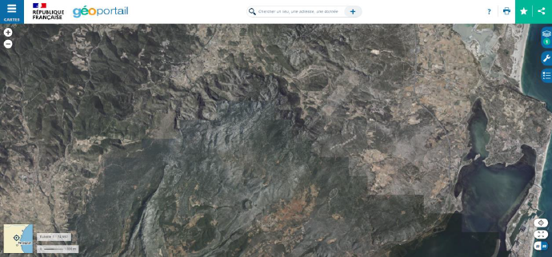

# Aerial Ortho-Image Color Normalization and Style Transfer

## Project Overview

This project addresses color inconsistencies in aerial ortho-images provided by the French National Institute of Geographic and Forestry Information (IGN). The IGN offers a comprehensive database of high-resolution aerial ortho-images, known as BD ORTHO, covering the entire national territory. These images are updated every three years, presenting a challenge in achieving color consistency when assembling images from different departments.

## Problem Statement

The color inconsistency arises due to the separate processing of ortho-images for individual departments, leading to variations in color even when the acquisition dates are close. The project aims to find solutions to this color inconsistency problem, exploring both physical approaches, such as estimating surface reflectance by removing atmospheric effects in the preprocessing phase, and post-processing solutions, particularly focusing on artificial intelligence methods.

## Objectives

1. Investigate physical approaches to correct color inconsistencies by estimating surface reflectance.
2. Explore artificial intelligence methods, particularly "Neural Style Transfer" and "Generative Adversarial Networks," to address color normalization challenges in aerial ortho-images.
3. Conduct experiments and testing on real data to evaluate the identified models and approaches.
4. Contribute to research and potentially publish findings in conferences or journals.

## Methodology

### Literature Review
- Conduct an in-depth review of existing methodologies for "color normalization" and "style transfer" with a focus on "Neural Style Transfer" and "Generative Adversarial Networks."

### Experimentation
- Propose and conduct experiments to test identified models on real aerial ortho-image data.

### Documentation
- Document the findings and results in a comprehensive report suitable for conference or journal publication.

## Project Scope

The project involves a multi-faceted approach, combining physical methods and cutting-edge artificial intelligence techniques to achieve color normalization in aerial ortho-images. The emphasis on "Neural Style Transfer" and "Generative Adversarial Networks" presents a novel application in the context of aerial image processing.

## Contributors

- [Belkhiter Yannis]
- [STORAI Romain]
- [TEXIER Lucas]

**Note:** This README provides an overview, and detailed documentation can be found in the project files.

*This project is part of ongoing efforts to enhance the quality of geographical and forestry information provided by IGN.*

